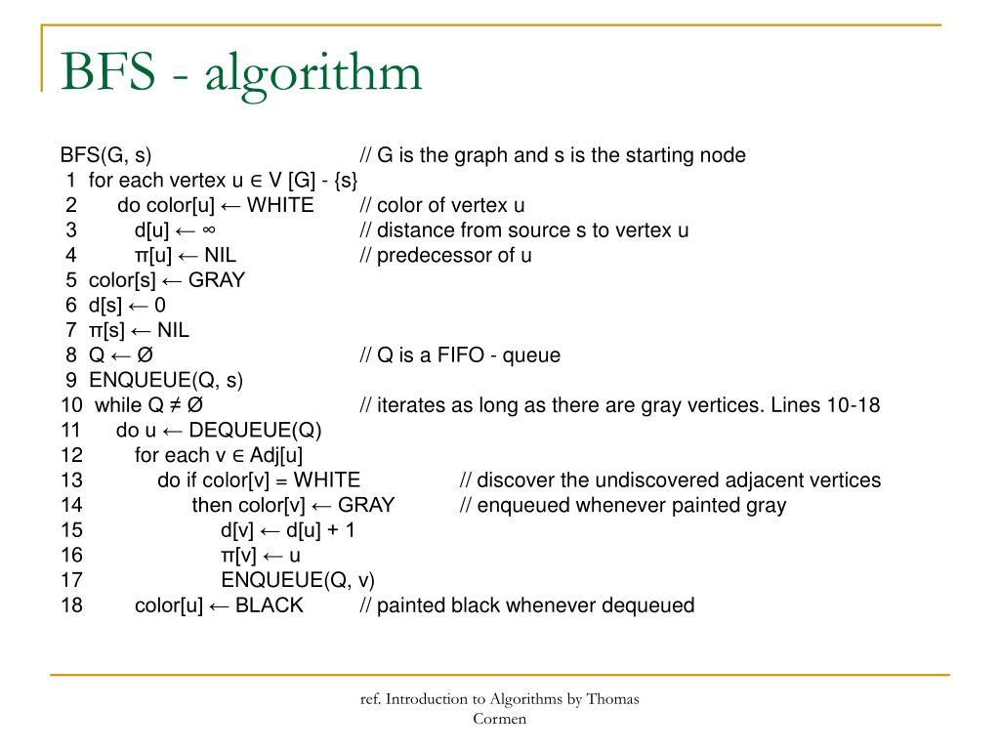
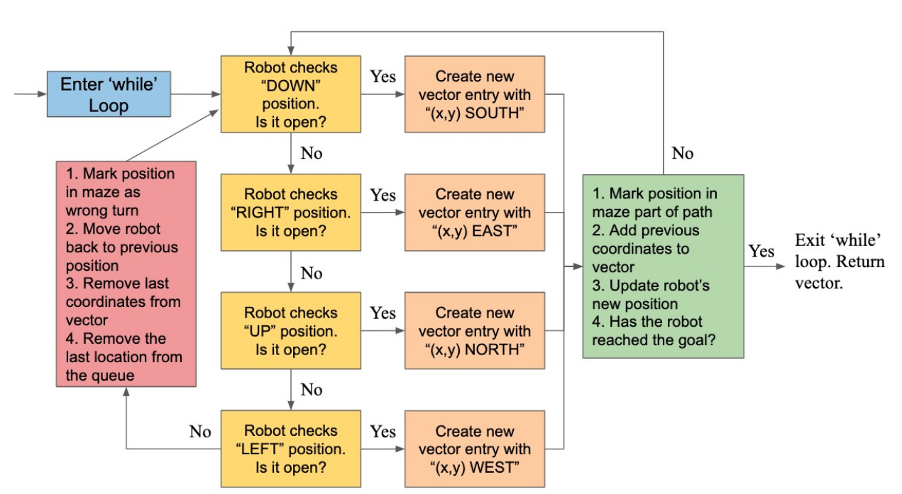
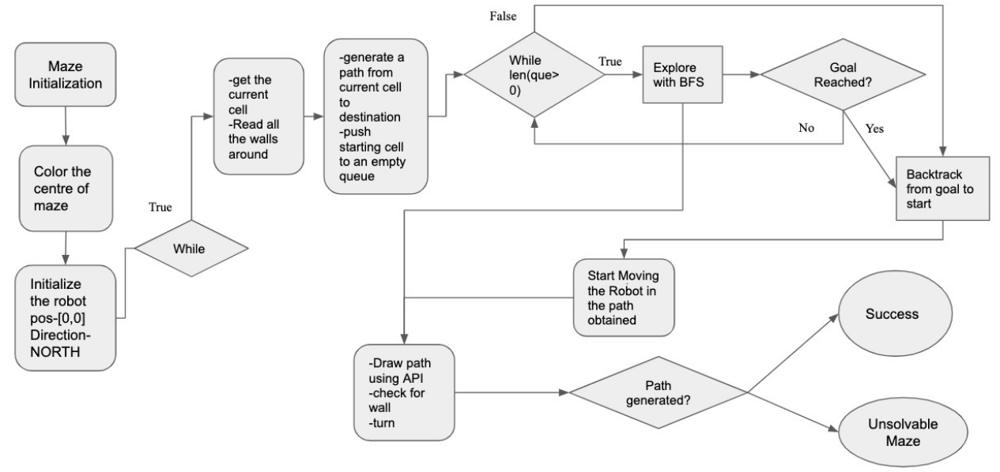
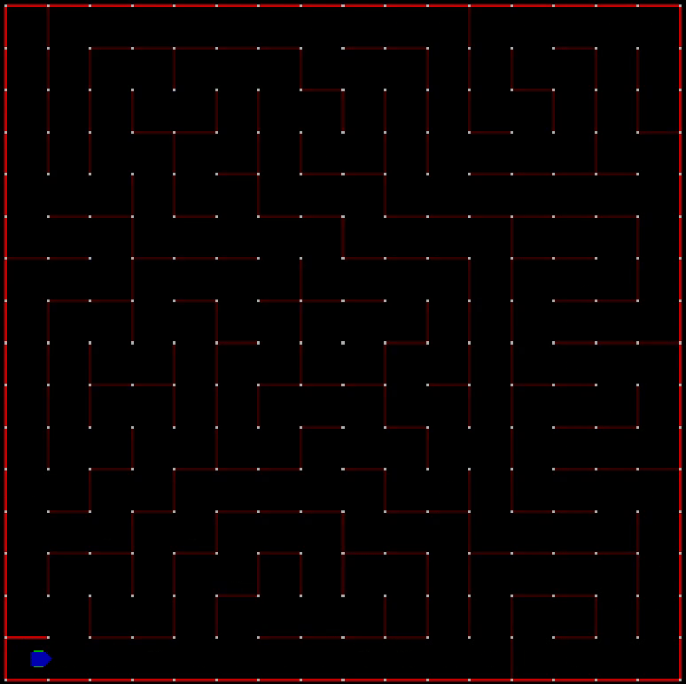

# Breadth First Search (BFS) using micromouse simulator


## Algorithm Process and Output Results

This uses another project which is open source.  The micromouse simulator (
https://
github.com/mackorone/mms
) is a small C
++
QT simulator that allows you to visualize path planning
algorithms.

### BFS Algorithm


### Graphical Representation of Program Structure




### Micromouse Simulator Output


## License
```
MIT License

Copyright (c) 2019 Aditya Vaishampayan

Permission is hereby granted, free of charge, to any person obtaining a copy
of this software and associated documentation files (the "Software"), to deal
in the Software without restriction, including without limitation the rights
to use, copy, modify, merge, publish, distribute, sublicense, and/or sell
copies of the Software, and to permit persons to whom the Software is
furnished to do so, subject to the following conditions:

The above copyright notice and this permission notice shall be included in all
copies or substantial portions of the Software.

THE SOFTWARE IS PROVIDED "AS IS", WITHOUT WARRANTY OF ANY KIND, EXPRESS OR
IMPLIED, INCLUDING BUT NOT LIMITED TO THE WARRANTIES OF MERCHANTABILITY,
FITNESS FOR A PARTICULAR PURPOSE AND NONINFRINGEMENT. IN NO EVENT SHALL THE
AUTHORS OR COPYRIGHT HOLDERS BE LIABLE FOR ANY CLAIM, DAMAGES OR OTHER
LIABILITY, WHETHER IN AN ACTION OF CONTRACT, TORT OR OTHERWISE, ARISING FROM,
OUT OF OR IN CONNECTION WITH THE SOFTWARE OR THE USE OR OTHER DEALINGS IN THE
SOFTWARE.
```

## Dependencies
Dependencies for C++ project:

- Micromouse Simulator

## Instruction for running the

In the MMS simulator, one needs to select a maze for the robot to traverse through in th "Maze" box.
Then click on '+' button to add a new mouse algorithm. Once the new mouse algorithm dialog box appears:
1. Next we need to enter the name for our project.
2. Then, we need to specify the location of the working directory (the path of the main.cpp).
3. Also, we need to specify the build command.

In this case, the build command will be "g++ -std=c++17 API/API.cpp Cell/Cell.cpp LandBasedRobot/LandBasedRobot.cpp LandBasedTracked/LandBasedTracked.cpp LandBasedWheeled/LandBasedWheeled.cpp Maze/Maze.cpp Algorithm/Algorithm.cpp Main.cpp".

I have used a c++17 feature so we need copy and use this build command.

4. fianlly one needs to specify the run command, i.e. "./a.out"
